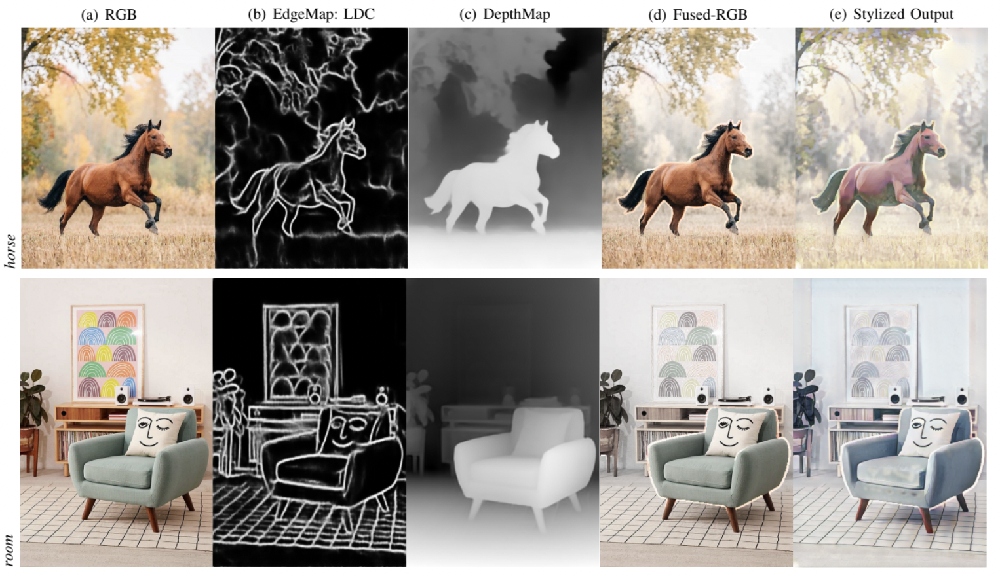

About Me
======

I have been a  master's student at University of Michigan in the Computer Science department. Advised by [Prof. Zheng Song](https://umdearborn.edu/people-um-dearborn/zheng-song) at University of Michigan Dearborn, I focused on developing system based solutions for usecases utilizing Wifi Sensing and Distributed Computing based solutions for Future Mobility. Previously I was advised by [Prof. Chetan Arora](https://www.cse.iitd.ac.in/~chetan/) and [Prof. Vinay Namboodri](https://vinaypn.github.io) where I focused on Font Interpolation in multi linguistic setting.
I spent fruitful time at IIIT Chennai as Project JRF, advised by [Prof. V Masilamani](https://www.iiitdm.ac.in/people/faculty/masila@iiitdm.ac.in), in which our team designed and developed desktop and web tools for preventing forged obscene image related cyber crimes. 

Web Links for work portfolio:

[Resume](https://drive.google.com/file/d/1S4DCs-e5daRELRfqEjJPbFkjNlEhRwex/view?usp=share_link)

[CV](https://drive.google.com/file/d/1CfEzSRm9qq0q56GY-pWFhLHzBt1oCyKK/view?usp=share_link)

Selected Technical Projects
===============

**Generative AI:**
  
  *SAIND: Scene Animation using (RGB) Images aNd Depth maps

  

  
  

  
  *Font Style generation for Scene Text Recognition

  

  
  

**Distributed Computing Systems for future mobility:**
  
  *Griffin: Collaborative Drone-Car for Real-time road event detection

   

  
  

**Wifi Sensing:**
  
  *BMEye: Public Health-Oriented Body Mass Index Monitoring Using Commodity WiFi

  

  
  

  *SWiDir: Enhancing Smartphone-based Walking Direction Estimation with Passive WiFi Sensing

  

  
  

